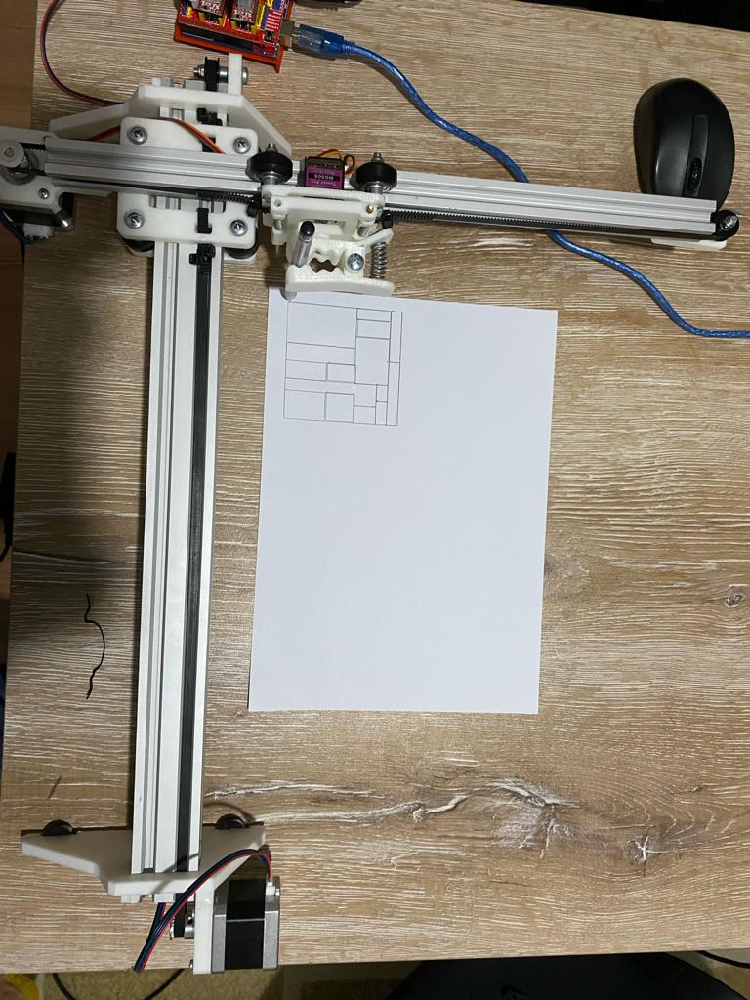

# The Two-Dimensional Cutting Stock Problem (2DCSP)

## Table of Contents

1. [Introduction](#introduction)
2. [Installation and Usage](#installation-and-usage)
3. [Screenshots](#screenshots)

## Introduction

The Two-Dimensional Cutting Stock Problem (2DCSP) is a crucial optimization challenge encountered in various manufacturing sectors including glass, wood, paper, and plastic industries. Its primary goal is to efficiently cut a predefined set of rectangular items from standard-sized rectangular materials, aiming to minimize material wastage and the total number of materials utilized. By addressing this problem effectively, businesses can enhance resource utilization and streamline their manufacturing processes, leading to cost savings and improved sustainability.

In this project, the process of placing 2D objects was done using genetic algorithm in Java programming language. There are many variables in the genetic algorithm. These variables are determined in an interface developed using Java Swing and are shown here visually. Then, the results obtained are converted to GCode for drawing or cutting operations. This process is done in Python, and an output is also obtained as png using the matplotlib library. Finally, the resulting GCode is transmitted directly from the terminal to the tool for the relevant cutting or drawing process through the interface made in Java, and the drawing starts directly by the written Arduino codes. A ready-made set was purchased from outside for the drawing process, but you can use any set you want but motors must controlled through arduino.

I used Hopper and Turton datasets to test the codes. There are 21 datasets in total.

## Installation and Usage

Before installation steps you need

- Java 21.0.2
- Python 3.10.9

```bash
pip install -r requirements.txt
```

After installation run the app

## Screenshots

- C1_1 Dataset

  

- C1_1 Dataset Output as a Png

  

- Custom Dataset

  

- Custom Dataset Output as a Png

  

- Plotting with Robot

  

  

  
